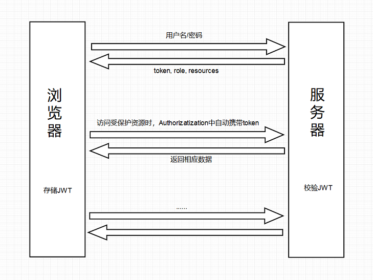

<h1 align="center">后端脚手架</h1>

## 项目特性

- :gem: **优雅美观**：基于 Spring Boot 体系精心设计
- :rocket: **最新技术栈**：使用 Spring Boot,Shiro,MyBatis 等前沿和成熟的技术开发
- :closed_lock_with_key: **安全认证**：基于 token 认证，实现按钮级别的权限认证
- :gear: **最佳实践**：良好的工程实践助您持续产出高质量代码
- :v: **快速高效**：前后端分离，专注后端，快速实现 restful 接口定义

## 项目目录
```
myspringboot  
├── logs -- 日志目录 
├── sql -- sql脚本目录 
├── src/main/java/cn.mypandora.springboot 
|   ├── config -- 通用配置  
|   |    ├── druid -- 连接池配置文件  
|   |    ├── shiro -- 权限框架配置文件 
|   |    └── swagger -- 接口文档配置文件   
|   ├── core -- 通用核心代码  
|   |    ├── base -- 通用Mapper及前端返回数据格式封装 
|   |    ├── enums -- 枚举类 
|   |    ├── exception -- 异常类 
|   |    ├── shiro -- shiro扩展配置 
|   |    ├── support -- XSS 过滤 
|   |    └── utils -- 工具类  
|   ├── modular -- 业务模块  
|   |    ├── system -- 通用后台管理代码目录 
|   |    └── your -- 放置你自己的业务代码
|   └── SpringbootApplication.java -- 项目启动类  
└── src/main/resources  
    ├── mapper -- Mybatis的Mapper.xml目录  
    ├── application.yml -- 项目默认配置文件  
    ├── application-dev.yml -- 开发环境配置文件  
    ├── application-docker.yml -- docker环境配置文件  
    ├── application-prod.yml -- 生产环境配置文件  
    └── logback-spring.xml -- 日志配置文件  
```

## 技术选型

[x] | 技术名 | 版本  
 :---: | :--- | :---  
[x] | SpringBoot | 2.1.7 
[x] | Redis(spring-boot-starter-data-redis) | 2.1.7
[x] | Mybatis(mybatis-spring-boot-starter) | 2.0.1  
[x] | Mapper(mapper-spring-boot-starter) | 2.1.5
[x] | PageHelper(pagehelper-spring-boot-starter) | 1.2.12 
[x] | Druid(druid-spring-boot-starter) | 1.1.16  
[x] | Shiro | 1.4.0 
[x] | jjwt | 0.10.7
[x] | jBCrypt | 0.4.1
[x] | jasypt-spring-boot-starter | 2.1.2
[x] | Swagger2(springfox.swagger2) | 2.9.2  
[x] | lombok | 1.18.8    

## 使用说明

1. 项目使用了Lombok简化代码，请安装对应的IDE插件。

## 开发环境

1. openjdk 11
2. MariaDB 10.4.7
3. Redis 5.0

## 快速开始
1. 下载项目
    ```
   git clone https://github.com/hankaibo/myspringboot.git
   ```
   
2. 导入项目
    
    使用自己的 IDE 导入, Intellij IDEA 社区版本即可。

3. 导入数据库

    执行 create.sql 文件，创建 MariaDB 数据库；安装 redis 创建 redis 数据库。

4. 配置数据库

    打开 application-dev.yml 修改 MySQL 和 Redis 连接信息。

5. 启动项目

    找到 SpringbootApplication 启动类, 启动即可。

6. 启动前端项目

    请参考前端项目[myantdpro](https://github.com/hankaibo/myantdpro)配置。

## 逻辑
  1. POST请求【用户名/密码】到 /api/v1/login 接口进行登入，如果成功返回一个加密 token,role及resources。
  
     token: 之后用户访问每一个需要权限的网址请求必须在 header 中添加 Authorization 字段，例如 Authorization: Bearer token。
  
     role：方便前端处理的角色信息。
  
     resources：用户对应的所有资源数据集合，对每个人的页面进行按钮等组件的动态显示与隐藏。
  2. 登录成功之后，自动发起GET请求（携带token）到 /api/v1/users/info，获取当前登录用户的信息 user和menuList。
     
     user: 当前登录用户的个人信息。
     
     menuList: 当前登录用户的菜单数据（动态菜单数据），与登录成功返回的数据中resources是相对应的。（菜单打开的页面包含资源，资源属于某个菜单对应的页面。）
  3. 之后单击页面相关按钮发送的请求，都会自动将 token 加入到 header 中，以保证有权限认证，可以成功请求到后台数据。
  
  
# 参考
本文大量参考了 [https://github.com/tomsun28/bootshiro](https://github.com/tomsun28/bootshiro)，特此感谢。
1. [https://jinnianshilongnian.iteye.com/blog/2049092](https://jinnianshilongnian.iteye.com/blog/2049092)
2. [https://github.com/tomsun28/bootshiro](https://github.com/tomsun28/bootshiro)
3. [https://github.com/zhaojun1998/Shiro-Action](https://github.com/zhaojun1998/Shiro-Action)
4. [https://github.com/Smith-Cruise/Spring-Boot-Shiro](https://github.com/Smith-Cruise/Spring-Boot-Shiro)
5. [https://github.com/zzycreate/spring-boot-seed](https://github.com/zzycreate/spring-boot-seed)
6. [https://github.com/stylefeng/Guns](https://github.com/stylefeng/Guns)
